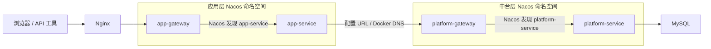

# NovaCloud 微服务架构实验

这是一个本地学习项目，复现双层网关和双 Nacos 命名空间的请求链路。当前包含 8 个长期运行的容器：Nginx、两个网关、两个 Java 业务服务、Nacos、MySQL、Redis。builder 是临时编译测试容器。

## 请求如何走



命名空间描述服务注册与发现的范围，服务进程本身运行在 Docker 容器中。所有容器目前使用同一实验网络，两个 Nacos 命名空间不等于两个网络隔离区。

应用层的 `PLATFORM_GATEWAY_URL=http://platform-gateway:8080` 模拟工作项目中部署配置提供的内网地址。Docker DNS 把这个名称解析到中台网关容器；两层网关各自通过 `lb://服务名` 和 Nacos 找到同层业务服务。这里不使用 Nacos 配置中心，仅使用其注册发现功能。

## 启动与验证

前提：Docker Desktop 已运行 Linux 容器后台，Windows 终端使用 PowerShell 7（验收脚本使用其 HTTP 错误响应参数）。不需要在 Windows 安装 Maven 或 Java 17；构建和运行均在容器中。

如果当前终端允许直接运行脚本，在本目录运行：

```powershell
./scripts/start.ps1
```

如果出现“在此系统上禁止运行脚本”，说明当前窗口使用了限制脚本执行的 Windows PowerShell 5.1。电脑已经安装 PowerShell 7，可以从当前窗口直接调用它：

```powershell
pwsh.exe -NoProfile -File .\scripts\start.ps1
```

项目此前已经构建过、代码也没有修改时，可以跳过编译和镜像重建，加快启动：

```powershell
pwsh.exe -NoProfile -File .\scripts\start.ps1 -SkipBuild
```

这条命令不修改 Windows 的全局执行策略。也可以在开始菜单打开“PowerShell 7”，进入本目录后再执行原来的 `./scripts/start.ps1`。

第一次启动会下载镜像和 Maven 依赖，生成 `.env` 本地随机数据库密码，编译测试、构建镜像，再按依赖启动组件，创建命名空间并验收。后续未修改代码时可以：

```powershell
./scripts/start.ps1 -SkipBuild
```

单独验证：

```powershell
./scripts/verify.ps1
```

## 访问入口

| 用途 | 地址 |
| --- | --- |
| 浏览器工单工作台 | http://127.0.0.1:18080/ |
| 完整请求查询 | http://127.0.0.1:18080/api/tickets/1 |
| Nacos 控制台 | http://127.0.0.1:18848/nacos/ |
| MySQL | 127.0.0.1:13306，库 novacloud，用户 lab，密码见本地 .env |
| Redis | 127.0.0.1:16379，密码见本地 .env 的 REDIS_PASSWORD；无浏览器页面 |

当前接口需要先登录，直接在浏览器访问会返回 401。运行步骤和账号说明见 [登录鉴权学习与操作](docs/登录鉴权学习与操作.md)。验收脚本会自动登录并清理自己的测试会话。

登录阶段实测：46 个 Java 测试通过，8 个容器健康；登录、权限、过期、退出及故障恢复均已验证。现在已增加 [浏览器工单工作台](docs/浏览器工作台学习与操作.md)，支持登录、查询、退出和请求信息展示。

限流阶段实测（2026-09-07）：54 个 Java 测试通过；真实 HTTP 并发额度、429、窗口恢复和 Redis 故障拒绝通过。启动验收现在会等待限流窗口恢复，通常额外需要约一分钟。

携带有效 token 的演示查询预期返回：

```json
{"id":1,"title":"Demo after-sales ticket","status":"OPEN"}
```

接口还支持观察不存在的记录（`/api/tickets/999999` → 404）和非法 ID（`/api/tickets/invalid` → 400）。各层添加 `X-Lab-*` 响应头并输出普通请求日志，便于核对路由；这些是演示标记，不是完整 TraceId。

Nacos 控制台中选择 application 或 platform 命名空间，各应看到两个服务。注册实例的地址是容器网络地址，无需手动填写容器 IP。宿主机只映射了 Nacos HTTP 控制台端口；Java 客户端在 Docker 网络内使用 8848/9848。以后若改为 Windows IDE 直接启动 Java，需要另行调整 Nacos gRPC 端口映射和注册地址。

## 查看与停止

```powershell
docker compose ps
docker compose logs --tail 50 app-service platform-service
docker compose logs --tail 50 app-gateway platform-gateway nginx
docker compose down
```

`down` 停止并删除本项目容器和网络，保留数据库、Nacos 数据及 Maven 缓存卷。再次运行启动脚本即可恢复。不要为普通重启添加 `-v`，它会删除命名卷中的数据。保留 `.env`，更改文件里的密码不会自动更改已有 MySQL 数据卷中的用户密码。初始化 SQL 仅在空 MySQL 数据卷第一次启动时执行。

故障实验仅操作带 `novacloud-lab` 项目标签的容器。应用层连接不到中台网关时返回 502，访问超时返回 504；中台网关找不到可用中台服务时可能返回 503。恢复被停止的组件后重新运行验收脚本。

## 文件导读

- `compose.yaml`：容器、网络、数据卷、环境变量、健康检查和依赖顺序。
- `app-gateway` / `platform-gateway`：Nacos 注册发现和同层路由。
- `app-service`：调用配置的中台网关地址，传递结果和错误状态。
- `platform-service`：参数化 SQL 查询 MySQL。
- `infra/nginx/nginx.conf`：入口代理。
- `infra/mysql/001-init.sql`：演示表和初始记录。
- `scripts/start.ps1`：构建、启动和验收。
- `scripts/init-nacos.ps1`：幂等创建两个命名空间。
- `scripts/verify.ps1`：完整链路及服务注册检查。
- `搭建日志.md`：实际操作、问题和验证结果。
- `学习文档.md`：已确认的架构背景、逐步学习内容和新学习任务的开场说明。
- `docs/第一阶段实施方案.md`：本阶段范围与验收标准。

## 版本与后续范围

固定学习基线：Java 17、Spring Boot 3.2.12、Spring Cloud 2023.0.3、Spring Cloud Alibaba 2023.0.3.2、Nacos 2.4.3、MySQL 8.4.4。网关沿用这一版本线的配置方式。这是用于理解既有企业项目的本地实验，未做生产部署或最新版本安全评估。

版本依据：[Spring Cloud Alibaba 2023 分支说明](https://sca.aliyun.com/en/docs/2023/overview/version-explain/)、[2023.0.3.2 发布记录](https://github.com/alibaba/spring-cloud-alibaba/releases/tag/2023.0.3.2)、[Nacos Docker 文档](https://www.nacos.io/zh-cn/docs/quick-start-docker.html)。具体兼容性以本项目构建和实测记录为准。

HTTP TraceId 传播和日志关联已实现，操作见 [TraceId学习与操作](docs/TraceId学习与操作.md)。Redis 说明见 [Redis学习与操作](docs/Redis学习与操作.md)。登录、退出和会话权限控制见 [登录鉴权学习与操作](docs/登录鉴权学习与操作.md)。登录与工单限流见 [限流学习与操作](docs/限流学习与操作.md)：默认同 IP 30 秒 10 次登录、同用户 10 秒 20 次工单请求，超额返回 429 和 Retry-After。Kafka 按用户要求暂不接入，Kubernetes 尚未迁移。当前 Nacos 使用单机无鉴权模式、所有对外端口仅绑定本机回环地址。

日志查询入口是 `scripts/show-trace.ps1 -TraceId 编号`；正常启动脚本会自动运行 `scripts/verify-trace.ps1`。四个 Java 容器和 Nginx 已配置每文件 10MB、最多 3 个文件的 Docker 日志轮转；容器重建会失去旧容器日志。

本阶段实测：23 个 Java 测试通过；TraceId 故障模式验证 12 个请求（含 6 个并发请求和 504 故障响应），恢复后原有 19 项链路检查通过。完整结果见《搭建日志.md》的 TraceId 验收记录。

## 第一阶段历史验收结果（2026-09-06，TraceId 改造前）

- 10 个自动测试全部通过。
- 19 项完整链路检查全部通过，验证了数据库记录、五层响应标记、错误状态和命名空间注册。
- 故障脚本实测返回 504 / platform_timeout，中台网关自动恢复后再次验收通过。
- `scripts/start.ps1 -SkipBuild` 重复运行成功。
- 7 个服务容器保持运行且健康；已有 cli-proxy-api 容器未被停止或修改。

可选故障实验（会短暂停止本实验中台网关并自动恢复）：

```powershell
./scripts/verify-failure.ps1
```

停机在不同网络环境下可能表现为立即失败或超时，因此该脚本接受明确对应的 502 / platform_unavailable 或 504 / platform_timeout。
